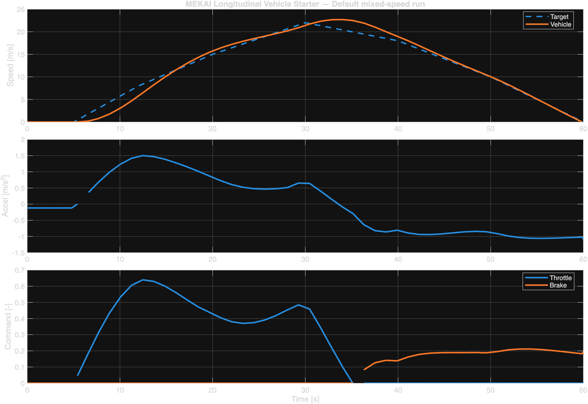

# MEKAI Longitudinal Vehicle Starter Lite

Free MATLAB / Simulink community edition for longitudinal vehicle dynamics and speed-control prototyping.

## Latest Update

MEKAI has now connected this lite release to a wider commercial engineering stack:

- File Exchange and Add-On Explorer discovery
- a dedicated MEKAI product page
- hosted checkout for the full version

Current product page:

- https://mekailab.com/engineering/longitudinal-vehicle-starter

This repository is the public discovery layer of a wider MEKAI engineering product line. It is built for:

- MATLAB Central File Exchange visibility
- Add-On Explorer discovery
- lightweight technical evaluation
- engineers who want a clean baseline instead of starting from a blank model

## What Is Included

- original Simulink starter model (`.slx`)
- baseline setup script
- baseline build script
- scenario helper
- one packaged preview image

## What It Helps With

- longitudinal vehicle studies
- speed-control prototyping
- internal experiments
- educational exploration
- quicker baseline setup for custom extensions

## What Is Not Included

The lite edition does not include the full MEKAI commercial packaging layer, including:

- `.mltbx` commercial toolbox packaging
- KPI export utilities
- commercial delivery documentation
- the wider engineering handoff layer

## Preview

## Upgrade Path

For the wider MEKAI MATLAB / Simulink product direction:

- https://mekailab.com/engineering/products
- https://mekailab.com/engineering/longitudinal-vehicle-starter
- https://mekailab.com

See [UPGRADE.md](UPGRADE.md) for the commercial direction.

## Release Notes

See [CHANGELOG.md](CHANGELOG.md) for the current release note.

## Important Note

This is original MEKAI content. It is not a certified production vehicle model and should be adapted and validated for any real engineering use case.
